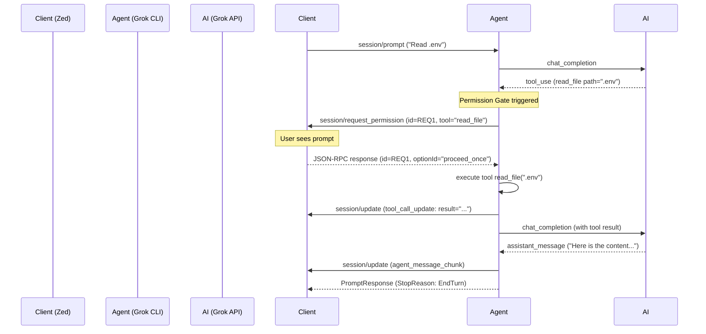

# ACP Permission Flow

This document explains the interactive permission flow implemented in the Grok CLI for Agent Client Protocol (ACP) clients like the Zed editor.

## Overview

To ensure user security and control, the Grok agent implements a "Permission Gate" that pauses execution before any tool is invoked. This allows the user to review the intended action (e.g., reading a sensitive file or running a shell command) and decide whether to proceed.

## The Three-Button UX

When a tool is triggered by the AI, the ACP client (Zed) will display a modal or notification with three options:

1.  **Allow Once** (`proceed_once`): Executes the current tool call. If the AI calls the same tool again in the same session, the user will be prompted again.
2.  **Always Allow** (`proceed_always`): Executes the current tool call and adds the tool to a session-level "Always Allow" set. Subsequent calls to the *same tool name* within the same conversation session will be executed automatically without further prompting.
3.  **Reject** (`cancel`): Blocks the tool execution. The agent will send a synthetic failure message back to the AI (e.g., "User rejected the tool execution"), allowing the AI to acknowledge the rejection and suggest an alternative or stop its current task.

## Sequence Diagram



## Protocol Details

### `session/request_permission` (Agent -> Client)

This is a JSON-RPC request sent from the Agent to the Client.

```json
{
  "jsonrpc": "2.0",
  "id": "550e8400-e29b-41d4-a716-446655440000",
  "method": "session/request_permission",
  "params": {
    "sessionId": "session-123",
    "requestId": "550e8400-e29b-41d4-a716-446655440000",
    "toolCallId": "call_abc123",
    "title": "Run read_file",
    "message": "Tool read_file:\n{\n  \"path\": \".env\"\n}",
    "kind": "execute"
  }
}
```

### Client Response (Client -> Agent)

The client responds with the chosen `optionId`.

```json
{
  "jsonrpc": "2.0",
  "id": "550e8400-e29b-41d4-a716-446655440000",
  "result": {
    "requestId": "550e8400-e29b-41d4-a716-446655440000",
    "optionId": "proceed_always"
  }
}
```

## Configuration

You can customize the permission behavior in your `.grok/config.toml`:

```toml
[acp]
# Set to false to disable all permission prompts (CI/automation mode)
require_permission = true

# How long (in seconds) the agent waits for a user response 
# before timing out and returning an error.
permission_timeout_secs = 60
```

## Resilience and Timeouts

- **Timeout**: If the user does not click a button within `permission_timeout_secs`, the agent will return an error to the client and the tool execution will fail.
- **Network Drops**: If the ACP connection is severed (e.g., during a Starlink handover) while a permission is pending, the agent will automatically treat the pending request as `cancel` to avoid hanging.
- **Concurrency**: The agent uses a non-blocking bidirectional loop, meaning it can handle other protocol messages while waiting for a permission response.
